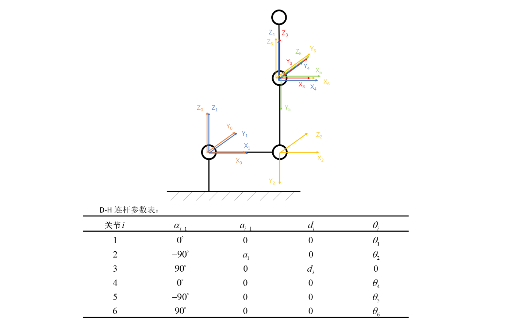
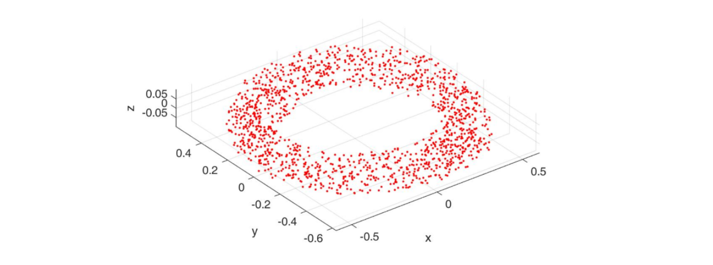
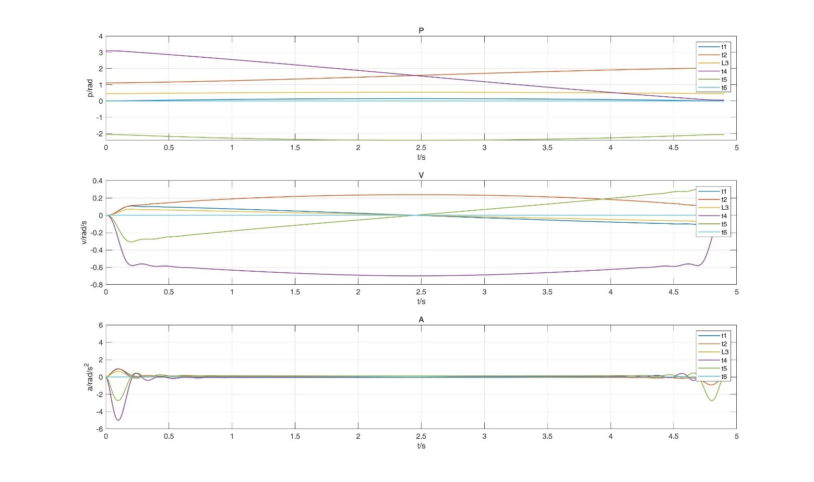
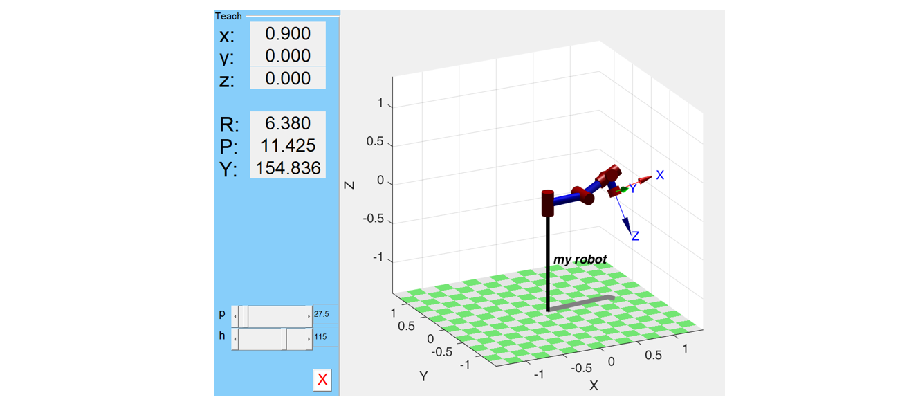

## 机械臂设计及其定点转动Minimum-Snap轨迹规划

详细文档请见`./Doc/机械臂设计及其定点转动Minimum-Snap轨迹规划.pdf`

using MATLAB 2018b

using MATLAB Robotics Toolbox

### Part 01 机械臂设计

设计一个六自由度机械臂，分析证明其操作器尖端的灵巧工作空间，并用蒙特卡洛方法验证了灵巧工作空间的正确性。

蒙特卡洛法验证灵巧空间：

### Part 02 Minimum-Snap 轨迹规划

令操作臂尖端位置固定，使其绕灵巧工作空间的某个内点作定点转动。选择三维空间中一段封闭圆作为第三关节目标轨迹，生成多个离散轨迹点。

利用**逆运动学求解**得到每个离散轨迹点对应的各关节变量，利用MATLAB Robotics Toolbox生成机械臂绕定点旋转动画，见`./Video`

采用Minimum Snap方法进行**轨迹规划，**将其抽象化为经典QP二次优化问题求解。

最终利用MATLAB进行动态演示，并实现在固定球坐标系下任意变化位置参数的演示交互界面。

### File

|      文件名/文件夹名      |              说明               |
| :-----------------------: | :-----------------------------: |
|    `Code/Assignment1`     |      Part1蒙特卡洛验证代码      |
|    `Code/Assignment2`     | Part2逆运动学求解及轨迹规划代码 |
| `Code/Assignment2/Main.m` |          Part2 主函数           |
|           `Doc`           |            说明文档             |
|          `Video`          |    Part2 MATLAB结果动画展示     |

注意：本项目对Robotics Toolbox 源码进行了部分修改，被修改的代码在`/Code/Assignment2/Toolbox 源码修改部分`目录下，将工具箱中对应文件替换即可使用（`RTBPlotGYM.m`是原工具箱中没有的代码，直接复制即可）